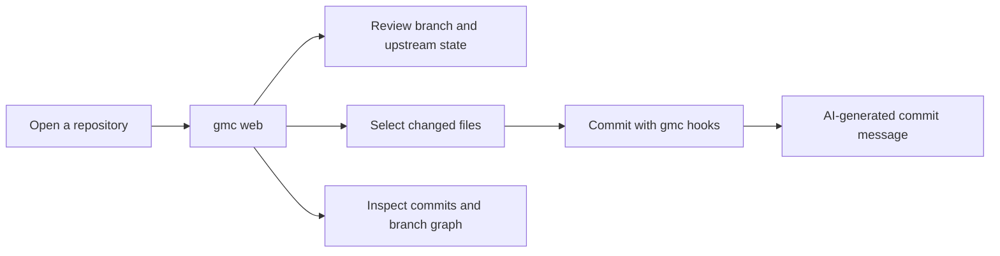

# GMC

> A local Git workbench for AI-assisted development. Start with `gmc web`: a visual dashboard for branches, changes, commit history, and AI-generated commit messages.

[简体中文](./README.zh-CN.md) | English


## Why GMC Web

`gmc web` turns the current Git repository into a local browser dashboard. It keeps the terminal-friendly workflow, but gives you a fast visual surface for the work that is easiest to misread in plain CLI output.

| What you see | Why it helps |
| --- | --- |
| Current branch, upstream, ahead/behind counts | Know whether you should push, pull, or keep working before you commit. |
| Working tree with selectable files | Commit the intended files without staging unrelated changes by accident. |
| Branch tree and recent commit graph | Understand where the current work sits in repository history. |
| Commit details on hover | Inspect a full commit message and file summary without leaving the page. |
| Background GMC task status | Track AI commit-message rewrites from the same place you review the repo. |



## Quick Start

Install from this repository:

```sh
npm install -g ./cli
```

Then open any Git repository:

```sh
cd path/to/your/repo
gmc web
```

`gmc web` starts a local server for the current repository and opens the dashboard. If a GMC Web server is already running, the command opens the existing server with the current repository selected.

Use a custom port when needed:

```sh
gmc web --port 4277
GMC_GITWEB_PORT=4277 gmc web
```

## Install The Full Local Workflow

```sh
gmc install --all
```

This installs GMC commit hooks and writes a repository-specific `git.webloc` link on macOS. After that, the short commit loop is:

```sh
git add .
git commit -m gmc
```

When the commit message is exactly `gmc`, the commit returns immediately. GMC records the new commit, starts AI message generation in the background, and rewrites that commit only if it is still `HEAD`. If the branch moves first, the task is skipped instead of changing older history.

Check background work:

```sh
gmc status
gmc retry HEAD
```

## Web Features

### Repository Overview

The first screen shows the current branch, upstream tracking, ahead/behind counts, changed file count, and recent contribution activity. This is the state you usually need before deciding whether to pull, push, commit, or pause.

### Visual Working Tree

Select changed files directly in the browser, then commit only those files. Untracked files can be ignored from the same panel, and selected changes can be restored when you intentionally want to discard them.

### Commit Graph

The commit graph combines recent history with branch coloring, branch ownership, author/date metadata, and hoverable commit details. It gives a compact visual check before pushing work or reviewing a generated commit message.

### AI Commit Messages

GMC can generate commit messages from staged diffs:

```sh
git add .
gmc message
```

Or generate, edit, and commit:

```sh
git add .
gmc commit
```

The hook-based path is the fastest daily workflow:

```sh
git commit -m gmc
```

## Requirements

- Git repository
- Node.js 18 or newer
- `codex` CLI for AI commit-message generation
- Optional: `claude` CLI for future agent workflows
- Optional: `GITHUB_TOKEN` or `GH_TOKEN` for GitHub API access when issue features are enabled

If Codex inherits an incompatible model from your user config, set:

```sh
export GMC_CODEX_MODEL=gpt-5-codex
```

Background commit-message generation times out after 10 minutes by default:

```sh
export GMC_CODEX_TIMEOUT_MS=600000
```

## Commands

| Command | Status | Purpose |
| --- | --- | --- |
| `gmc web [--port 4277] [--no-open]` | Ready | Start or open the local GitWeb dashboard. |
| `gmc install --all [--port 4277]` | Ready | Install hooks and create the local Web link. |
| `gmc install-hooks` | Ready | Install only the non-blocking commit-message hooks. |
| `gmc status` | Ready | Show repository binding and recent background tasks. |
| `gmc message` | Ready | Generate a commit message from staged changes. |
| `gmc commit [--no-edit]` | Ready | Generate a message and commit staged changes. |
| `gmc retry [commit]` | Ready | Queue another background message attempt. |
| `gmc <issue>` / `gmc bind <issue>` | Later | Issue-centered sessions are being redesigned and are not the main workflow yet. |

## Safety Model

- GMC Web serves `127.0.0.1` only.
- Credentials are read from environment variables and are not written to the repository.
- Issue bindings, when used, are stored in local Git config and `.git/gmc/current.json`.
- Background commit-message rewrites only target the recorded commit while it is still `HEAD`.
- Automatic rewrites are skipped during merge/rebase-style operations and for signed commits.

## Later: Issue-Centered Workflows

The original GMC direction was:

```text
GitHub Issue -> AI coding session -> branch binding -> commit message trailer
```

That flow still exists as an MVP command surface, but it is not complete enough to lead the product. The next issue-focused work should make issue discovery, branch binding, agent launch, and commit trailers visible and controllable from GMC Web instead of treating them as separate CLI-only steps.

Planned areas:

- Browse and select GitHub issues in the Web UI.
- Create or switch issue branches from the dashboard.
- Launch Codex or Claude with issue context.
- Show the bound issue next to branch and commit state.
- Keep `Issue: GH-123` trailers reliable without making the daily workflow depend on unfinished issue tooling.
