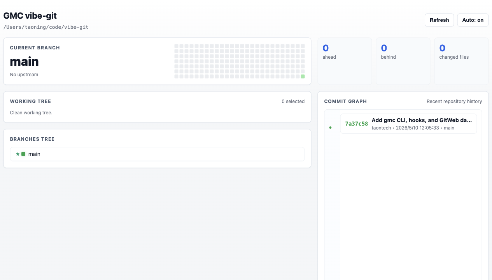
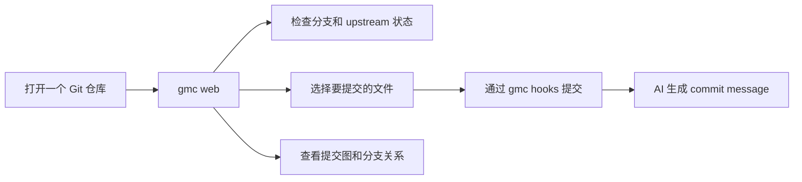

# GMC

> 面向 AI 编程的本地 Git 工作台。先从 `gmc web` 开始：用浏览器可视化查看分支、变更、提交历史和 AI 生成提交信息的后台任务。

简体中文 | [English](./README.md)



## 为什么优先用 GMC Web

`gmc web` 会把当前 Git 仓库变成本地浏览器 Dashboard。它保留命令行的直接性，同时把最容易在 CLI 输出里看错的状态可视化出来。

| 你能看到什么 | 带来的好处 |
| --- | --- |
| 当前分支、upstream、ahead/behind 数量 | 提交前先判断应该 push、pull，还是继续开发。 |
| 可勾选文件的 Working Tree | 只提交想提交的文件，降低误带无关改动的概率。 |
| 分支树和最近提交图 | 快速理解当前工作处在仓库历史的哪个位置。 |
| 悬停查看提交详情 | 不离开页面就能看完整 commit message 和文件摘要。 |
| GMC 后台任务状态 | 在同一个页面追踪 AI commit message 改写是否完成、失败或跳过。 |



## 快速开始

从 npm 安装：

```sh
npm install -g gmc
gmc --version
```

然后打开任意 Git 仓库：

```sh
cd path/to/your/repo
gmc web
```

`gmc web` 会为当前仓库启动本地服务并打开 Dashboard。如果 GMC Web 服务已经在运行，它会直接打开已有服务并选中当前仓库。

需要固定端口时：

```sh
gmc web --port 4277
GMC_GITWEB_PORT=4277 gmc web
```

## 安装完整本地工作流

```sh
gmc install --all
```

这个命令会安装 GMC commit hooks，并在 macOS 上写入仓库专属的 `git.webloc` 链接。之后日常提交可以简化成：

```sh
git add .
git commit -m gmc
```

当 commit message 正好是 `gmc` 时，提交会立即返回。GMC 会记录新提交，在后台启动 AI message 生成，并且只在该提交仍然是 `HEAD` 时改写它。如果分支已经前进，后台任务会跳过，避免改写旧历史。

查看后台任务：

```sh
gmc status
gmc retry HEAD
```

## Web 功能

### 仓库概览

首屏展示当前分支、upstream、ahead/behind 数量、变更文件数量和最近贡献热力。提交、push、pull 或暂停前，通常先看这里就够了。

### 可视化 Working Tree

在浏览器里直接勾选变更文件，然后只提交这些文件。未跟踪文件可以从同一个面板加入 `.gitignore`，明确要丢弃的改动也可以直接 restore。

### Commit Graph

提交图把最近历史、分支颜色、分支归属、作者和时间放在一起。push 前或检查 AI 生成的提交信息前，可以先用它快速确认历史形状。

### AI Commit Message

从 staged diff 生成 commit message：

```sh
git add .
gmc message
```

生成、编辑并提交：

```sh
git add .
gmc commit
```

最快的日常路径是 hook 模式：

```sh
git commit -m gmc
```

## 环境要求

- Git 仓库
- Node.js 18 或更新版本
- `codex` CLI，用于 AI commit message 生成
- 可选：`claude` CLI，用于后续 agent 工作流
- 可选：`GITHUB_TOKEN` 或 `GH_TOKEN`，在 issue 功能启用时访问 GitHub API

如果 Codex 继承了不兼容的用户配置模型，可以设置：

```sh
export GMC_CODEX_MODEL=gpt-5-codex
```

后台 commit message 生成默认 10 分钟超时：

```sh
export GMC_CODEX_TIMEOUT_MS=600000
```

## 命令概览

| 命令 | 状态 | 用途 |
| --- | --- | --- |
| `gmc --version` | 可用 | 输出已安装 CLI 版本。 |
| `gmc web [--port 4277] [--no-open]` | 可用 | 启动或打开本地 GitWeb Dashboard。 |
| `gmc install --all [--port 4277]` | 可用 | 安装 hooks 并创建本地 Web 链接。 |
| `gmc install-hooks` | 可用 | 只安装非阻塞 commit message hooks。 |
| `gmc status` | 可用 | 查看仓库绑定和最近后台任务。 |
| `gmc message` | 可用 | 基于 staged changes 生成 commit message。 |
| `gmc commit [--no-edit]` | 可用 | 生成 message 并提交 staged changes。 |
| `gmc retry [commit]` | 可用 | 重新排队一次后台 message 生成。 |
| `gmc <issue>` / `gmc bind <issue>` | 稍后实现 | issue 驱动的会话正在重新设计，目前不作为主工作流。 |

## 安全模型

- GMC Web 只监听 `127.0.0.1`。
- 凭据通过环境变量读取，不会写入仓库。
- 使用 issue 绑定时，信息存储在本地 Git config 和 `.git/gmc/current.json`。
- 后台 commit message 改写只会作用于记录下来的提交，并且要求它仍然是 `HEAD`。
- merge/rebase 类操作和签名提交会跳过自动改写。

## 稍后实现：Issue 驱动工作流

GMC 最初的方向是：

```text
GitHub Issue -> AI coding session -> branch binding -> commit message trailer
```

这条链路目前仍有 MVP 命令，但还不够完整，不适合作为产品主入口。下一步应该把 issue 发现、分支绑定、agent 启动和 commit trailer 都接入 GMC Web，让它们成为可见、可控的流程，而不是分散在 CLI 里的独立步骤。

计划中的方向：

- 在 Web UI 中浏览和选择 GitHub issues。
- 从 Dashboard 创建或切换 issue 分支。
- 带着 issue 上下文启动 Codex 或 Claude。
- 在分支和提交状态旁展示绑定的 issue。
- 保持 `Issue: GH-123` trailer 可靠，但不让日常工作流依赖尚未完善的 issue 工具。
